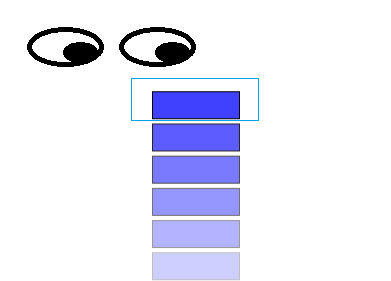
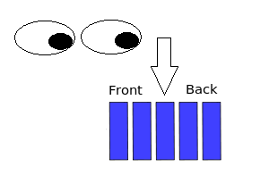
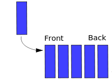
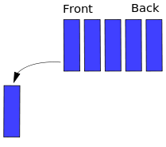
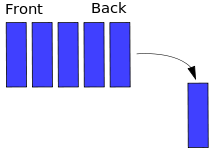
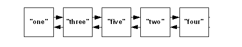
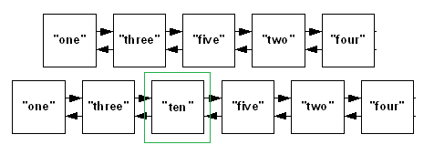

\#. Data Structures in JavaScript
---------------------------------

According to Wikipedia:

*"In computer science, a data structure is a particular way of storing and
organizing data in a computer so that it can be used efficiently."*

In this article, we will be using some structures which, personally, look like
the most basic ones. I know that, through Arrays you can have a greater
performance, but the point of this exercise is to practice the understanding of
code.

### \#. Types of data structures:

1.  Stack

2.  Queue

3.  Deque

4.  Linked list

5.  Doubly linked list

### \#. Stack 


-   A stack is a particular data type or collection in which the main operations
    are the addition of an item, known as push, and removal of it, known as pop.

-   Stacks implement a LIFO (Last in First Out) structure which means that the
    last element added to the structure must be the first one to be removed.

It will have the following initial code: 

function Stack(){

var top = null;

var count = 0;

//Returns the number of items in the queue

this.GetCount = function(){

return count;

}

/\* Methods \*/

}

Our stack is going to have four additional methods: Push(data), Pop(), Peek(),
and DisplayAll(). These will be defined inside the
function Stack() below this.count. Well then, let's start:

\#. Push:


Description: Pushes (adds) the specified data into the Stack and makes it the
top node. It also increases the stack count by 1.

this.Push = function (data) {

//Creates a node containing the data and a reference to the next item, if any.

var node = {

data: data,

next: null

};

//links current node to the top node. If the stack is empty it will have null as
reference

node.next = top;

//makes the current node as the top node.

top = node;

//Increases the count

count++;

}

\#. Peek:



Description: Peeks at the item from the top of the stack. Returns null if the
stack is empty.

this.Peek = function(){

//If there are no items, returns null. (avoid error)

if(top === null){

return null;

}

else{

return top.data;

}

}

\#. Pop:


Description: It looks quite similar to the PEEK() method, but it also removes
the top item and decreases the count by 1.

this.Pop = function () {

//If there are no items, returns null. (avoid error)

if (top === null) {

return null;

}

else {

//assigns top to a temp variable

var out = top;

//makes the TOP as the next in line

top = top.next;

//there still are items on the stack

if (count \> 0) {

count--;

}

//returns the value that was removed

return out.data;

}

}

\#. Display All:

Description: Displays all data from the stack as an array. To display it as an
array was chosen by me because I was not sure on how I would display it
(e.g. console.log, document.write, etc...)

this.DisplayAll = function(){

if (top === null) {

return null;

}

else {

//instantiate an array

var arr = new Array();

//creates a node to move through the stack

var current = top;

//moves through the stack until it reaches the bottom item

for (var i = 0; i \< count; i++) {

//assigns the data to the array

arr[i] = current.data;

//advances one step

current = current.next;

}

//returns the array

return arr;

}

}  

So, there are four methods of stack

Push(data)

Pop()

Peek()

DisplayAll()

### \#. Queue 


Queues are collection that keep objects in a certain order while applying the
FIFO (First in First out) format. It is just like a line of people, except that
data doesn't cut in it:

function Queue(){

var count = 0;

//Yes, I don't use back and front.

var head = null;

var tail = null;

//Returns the number of items in the queue

this.GetCount = function(){

return count;

}

/\* Methods \*/

}

Our queue is also going to have 4 additional
methods: Enqueue(data), Dequeue(), PeekAt(), and DisplayAll().

\#. Enqueue:


Description: Adds an item at the front of the queue. The process is the same as
PUSH from stack, but I changed for the sake of the exercise.

this.Enqueue = function (data) {

//Creates a node with the data

var node = {

data: data,

//next points to value straight way. If head is null, it won't be a problem

next: head

};

//if it is the first item, then the head is also the tail

if (head === null) {

tail = node;

}

//defines the node as the new head

head = node;

//increases the count

count++;

}

\#. Dequeue:


Description: Removes and returns the last item inserted and stored which would
be the one at the opposite side of the queue.

this.Dequeue = function () {

//if queue is empty, returns null

if (count === 0) {

return;

}

else {

var current = head;

var previous = null;

//while there is a next, it will advance the queue.

//the idea is to have "current" at the end and "previous" as the one before last

while (current.next) {

previous = current;

current = current.next;

}

//if there is more than 1 item,

//Removes the tail and decreases count by 1.

if (count \> 1) {

//Remove the reference to the last one.

previous.next = null;

//makes tail point to the previous node.

tail = previous;

}

//resets the queue

else {

head = null;

tail = null;

}

count--;

}

}

\#. Display all:

Description: The name says all. It works the same as the method from stack().

this.DisplayAll = function () {

//

//I will leave the analysis to you.

//

if (head === null) {

return null;

}

else {

var arr = new Array();

var current = head;

for (var i = 0; i \< count; i++) {

arr[i] = current.data;

current = current.next;

}

return arr;

}

}

\#. Peek At:



Description: follows the idea of peek, but any item from the queue can be
searched and seen.

this.PeekAt = function (index) {

//anything smaller than 0 and equal or greater than count is not at the queue

if (index \> -1 && index \< count) {

var current = head;

//Navigates through the queue to find the item

for(var i = 0; i \< index; i++){

current = current.next;

}

return current.data;

}

//an index out of the bounds of the queue was chosen.

else {

return null;

}

}

So, there are four methods of Queue:

Enqueue(data)

Dequeue()

Displayall()

Peekat(index)

### \#. Linked list


Linked lists are data structures that are made of groups of nodes which together
represent a sequence. You will notice that both the Queue and the Stack where
made using the basic idea of a linked list. However, they have special rule
which makes them different in functionality.

function LinkedList() {

var count = 0;

var head = null;

this.GetCount = function(){

return count;

}

// Methods go here

}

Our Linked list will have 6 methods: DisplayAll(), DisplayAt(index),
AddFirst(data), Add(data, index), RemoveFirst(), RemoveAt.

\#. Display all:

Description: The name says all. Returns an array with the data or if empty it
returns null.

this.DisplayAll = function () {

//if is empty

if (head === null) {

return null;

}

else {

//if not, runs trough the list and place it in an array.

var arr = new Array();

var current = head;

for (var i = 0; i \< count; i++) {

arr[i] = current.data;

current = current.next;

}

return arr;

}

}

\#. Display At:

Description: Like the previous PeekAt(index) method from Queue display at a
specific index or if out of bounds it return null.

this.DisplayAt = function (index) {

//check for out-of-bounds values

if (index \> -1 && index \< count) {

var current = head;

var i = 0;

//this was not me, it is from nczonline(see source).

//It is a different way to implelement from the FOR we've been using

//and I wanted everyone have the chance to know it.

while (i++ \< index) {

current = current.next;

}

return current.data;

}

else {

return null;

}

}

\#. Add First:

Description: Adds to the front of the list. If you are wondering, front is where
the index is 0 and referenced by head.

this.AddFirst = function(data) {

//creates a new node

var node = {

data: data,

next: head

};

head = node;

count++;

}

\#. Add:


Description: Adds an item to the list at the specified position.

this.Add = function (data, index) {

//if the chosen index is 0 do the AddFirst(data) method.

if (index === 0) {

this.AddFirst(data);

}

//check for out-of-bounds values

else if (index \> -1 && index \< count) {

var node = {

data: data,

next: null

};

var previous;

var current = head;

var i = 0;

//find the right location

while (i++ \< index) {

previous = current;

current = current.next;

}

previous.next = node;

node.next = current;

count++;

}

else {

alert("out of range");

}

}

\#. Remove First:

Description: Removes the first item.

this.RemoveFirst = function () {

//if no items on the list, returns null

if (head === null) {

return null;

}

else {

var out = head;

head = head.next;

if (count \> 0) {

count--;

}

return out.data;

}

}

**\#. Remove At:** Description: Removes an item from a specific index


this.RemoveAt = function (index) {

if (index === 0) {

return this.RemoveFirst(index);

}

//check for out-of-bounds values

else if (index \> -1 && index \< count) {

var current = head;

var previous;

var i = 0;

//find the right location

while (i++ \< index) {

previous = current;

current = current.next;

}

//skip over the item to remove

previous.next = current.next;

//decrement the length

count--;

}

else {

return null;

}

//return the value

return current.data;

}

So, there are 6 methods of Linked list:

Displayall()

Displayat(index)

Addfirst(data)

Add(data,index)

Removefirst()

Removeat(index)

### \#. Deque

**Deque (Double-ended queue)**: The Double-ended queue is basically like a
queue, except that you can add or remove from either side. Now that you are a
bit more used to how this works, I would like to make things a bit harder.


function Deque() {

var count = 0;

var head = null;

var tail = null;

//Allows to view the value stored on Head

this.getHead = function() {

if (head) {

return head.data;

}

return null;

}

//Allows to view the value stored on Tail

this.getTail = function() {

if (tail) {

return tail.data;

}

return null;

}

//Returns the number of items

this.GetCount = function() {

return count;

}

//Lets define the node structure outside of each method.

//This way it will need to be done only once

var Node = function(data) {

this.data = data;

this.next = null;

}

//Methods go here

}

The deque will have way more methods than the other, with a total of 10, the
ones you've seen
and: DisplayHeadToTail(), DisplayTailToHead() AddHead(data), AddTail(data),RemoveHead() and RemoveTail().

**\#. Display Head to Tail:** Description: Returns an array with the data or if
empty it returns null.

this.DisplayHeadToTail = function() {

if (head != null) {

var arr = new Array();

var current = head;

//while there is a current

while (current) {

arr.push(current.data);

current = current.next;

}

return arr;

} else {

return null;

}

}

\#. Display Tail to Head

Description: Returns the deque data from end to start (opposite from before).

this.DisplayTailToHead = function() {

if (head != null) {

//call DisplayHeadToTail() and reverse it.

var arr = this.DisplayHeadToTail();

//This is one of the many great methods from javascript.

return arr.reverse();

} else {

return null;

}

}

**\#. Add Head:** Description: Add to the front(head) of the deque.



this.AddHead = function(data) {

//As you can see, now we only need to declare a new node

var node = new Node(data);

node.next = head;

head = node;

//if the list was empty

if (!tail) {

tail = head;

}

count++;

}

**\#. Add Tail:** Description: Add to the end(tail) of the deque


this.AddTail = function(data) {

var node = new Node(data);

//if the list was empty

if (!head) {

head = node;

} else {

tail.next = node;

}

tail = node;

count++;

}

**\#. Remove Head:** Description: Removes at the front(head) of the deque



this.RemoveHead = function() {

if (head) {

//If it's the last item

if (count === 1) {

head = null;

tail = null;

} else {

head = head.next;

}

count--;

}

}

**\#. Remove Tail:** Removes at the end(tail) of the deque



this.RemoveTail = function() {

if (head) {

//If it's the last item

if (count === 1) {

head = null;

tail = null;

} else {

var current = head;

//we need to go as far as the 2 before last

while (current.next.next) {

current = current.next;

}

tail = current;

tail.next = null;

}

count--;

}

}

So, Deque have the following methods:

DisplayHeadToTail()

DisplayTailToHead()

AddHead(data)

AddTail(data)

RemoveHead()

RemoveHead()

### \#. Doubly linked list



The Doubly linked list works by the same principle as the linked list. However,
each node contains a reference to both previous and next node, if such node is
available. This is particularly useful when there is a need to travel backwards
as well as forward.

function DoublyLinkedList(){

var count = 0;

var head = null;

var tail = null;

//Allows to view the value stored on Head

this.getHead = function() {

if (head) {

return head.data;

}

return null;

}

//Allows to view the value stored on Tail

this.getTail = function() {

if (tail) {

return tail.data;

}

return null;

}

//Returns the number of items

this.GetCount = function() {

return count;

}

//Defines the node

var Node = function(data) {

this.data = data;

this.next = null;

this.previous = null;

}

// Methods go here

}

Our Doubly Linked list will be the final challenge and the longest one with an
additional 9
methods: DisplayAll(), DisplayAllBackwards() DisplayAt(index), AddFirst(data),AddLast(data), Add(data,
index), RemoveFirst(), RemoveFirst(), RemoveAt.

\#. Display All:

Description: Returns an array with the data or if empty it returns null.

this.DisplayAll = function () {

//Most of the time, head won't be null, so lets start by that this time

if (head) {

var arr = new Array();

var current = head;

for (var i = 0; i \< count; i++) {

arr[i] = current.data;

current = current.next;

}

return arr;

}

else {

return null;

}

}

\#. Display All Backwards:

Description: Returns an array with the data from tail to head or if empty it
returns null. Take a close look at this method and think how hard would be to
implement it in a normal linked list

this.DisplayAllBackwards = function(){

if (head) {

var arr = new Array();

var current = tail;

for (var i = 0; i \< count; i++) {

arr[i] = current.data;

current = current.previous;

}

return arr;

}

else {

return null;

}

}

**\#. Display At:** Description: Works the same way as with linked list.


this.DisplayAt = function (index) {

//check for out-of-bounds values

if (index \> -1 && index \< count) {

var current = head;

var i = 0;

//this was not me, it is from nczonline(see source).

//It is a different way to implelement from the FOR we've been using

//and I wanted everyone have the chance to know it.

while (i++ \< index) {

current = current.next;

}

return current.data;

}

else {

return null;

}

}

**\#. Add First:** Description: Adds to the front of the doubly linked list.

this.AddFirst = function (data) {

//creates a new node

var node = new Node(data);

node.next = head;

head = node;

//if the list was empty

if (count === 0) {

tail = head;

}

else {

//Don't forget about the previous node. It also needs to be referenced.

head.next.previous = head;

}

count++;

}

**\#. Add Last** Description: Add to the end of the doubly linked list.

this.AddLast = function (data) {

var node = new Node(data);

node.previous = tail;

if (count === 0) {

head = node;

}

else {

tail.next = node;

}

tail = node;

count++;

}

\#. Add:



Description: Adds an item at the specified position. Tip: Draw the process if
necessary, it is not as simple as you might think.

this.Add = function (data, index) {

//check for out-of-bounds values

if (index \> 0 && index \< count) {

var node = new Node(data);

var current = head;

var i = 0;

//find the right location

while (i++ \< index) {

current = current.next;

}

current.previous.next = node;

node.next = current;

node.previous = current.previous;

current.previous = node;

count++;

}

else if (index \< 1) {

this.AddFirst(data);

}

else {

this.AddLast(data);

}

}

**\#. Remove First:** Description: Removes the first item.

this.RemoveFirst = function () {

if (head) {

head = head.next;

count--;

//there was only one item

if (count === 0) {

tail = null;

}

else {

//Don't forget about the previous node. It also needs the reference set to null.

head.previous = null;

}

}

}

**\#. Remove Last:** Description: Removes the last item.

```js
this.RemoveLast = function () {

if (head) {

//there is only one item

if (count === 1) {

head = null;

tail = null;

}

else {

tail.previous.next = null;

tail = tail.previous;

}

count--;

}

}
```
**\#. Remove At:** Description: Removes an item from a specific index


this.RemoveAt = function (index) {

//check for out-of-bounds values

if (index \> 0 && index \< count-1) {

var current = head;

var i = 0;

//find the right location

while (i++ \< index) {

current = current.next;

}

current.previous.next = current.next;

current.next.previous = current.previous;

count--;

}

else if (index \< 1) {

this.RemoveFirst();

}

else {

this.RemoveLast();

}

}

So, Doubly linked list has the following methods:

Displayall()

Displayallbackwards()

Displayat(index)

Addfirst(data)

Addlast(data)

Add(data,index)

Removefirst()

Removelast()

Removeat(index)

### \#. Tree

A Tree is a widely used data structure that simulates a hierarchical tree
structure, with a root value and subtrees of children with a parent node.

A tree data structure can be defined recursively (locally) as a collection of
nodes (starting at a root node), where each node is a data structure consisting
of a value, together with a list of references to nodes (the "children"), with
the constraints that no reference is duplicated, and none points to the root.


A simple unordered tree; in this diagram above, the node labeled 7 has two
children, labeled 2 and 6, and one parent, labeled 2. The root node, at the top,
has no parent.

\#. Complexity:

Average

| Access | Search | Insertion | Deletion |
| ------ | ------ | --------- | -------- |
| O(n)   | O(n)   | O(n)      | O(n)     |

#### \#. Binary Search Tree:

-   Binary search trees (BST), sometimes called ordered or sorted binary trees,
    are a particular type of container: data structures that store "items" (such
    as numbers, names etc.) in memory.

-   They allow fast lookup, addition and removal of items, and can be used to
    implement either dynamic sets of items, or lookup tables that allow finding
    an item by its key (e.g., finding the phone number of a person by name).

-   Binary search trees keep their keys in sorted order, so that lookup and
    other operations can use the principle of binary search: when looking for a
    key in a tree (or a place to insert a new key), they traverse the tree from
    root to leaf, making comparisons to keys stored in the nodes of the tree and
    deciding, on the basis of the comparison, to continue searching in the left
    or right subtrees.

-   On average, this means that each comparison allows the operations to skip
    about half of the tree, so that each lookup, insertion or deletion takes
    time proportional to the logarithm of the number of items stored in the
    tree.

-   This is much better than the linear time required to find items by key in an
    (unsorted) array, but slower than the corresponding operations on hash
    tables

Binary search time complexity
╔═══════════╦══════════╦════════════╗
║ Algorithm ║ Average  ║ Worst Case ║
╠═══════════╬══════════╬════════════╣
║ Space     ║ O(n)     ║ O(n)       ║
║ Search    ║ O(log n) ║ O(n)       ║
║ Insert    ║ O(log n) ║ O(n)       ║
║ Delete    ║ O(log n) ║ O(n)       ║
╚═══════════╩══════════╩════════════╝

### \#. Trie

### \#. Heap

### \# Hash Table

### \# Graph
