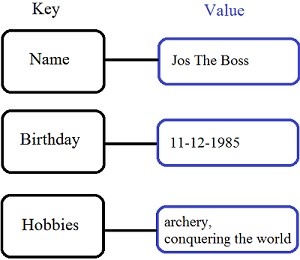
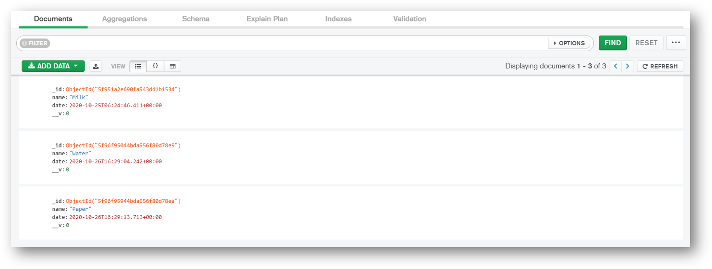
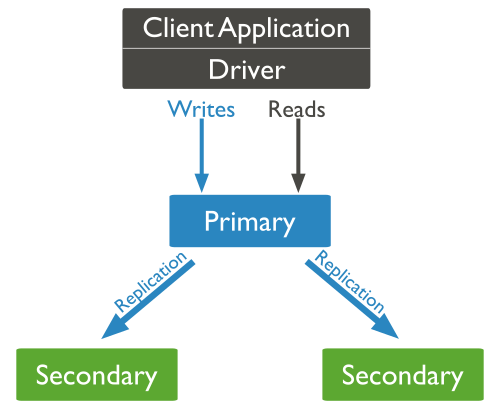
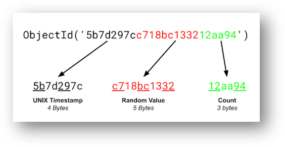
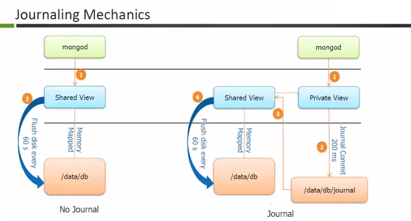
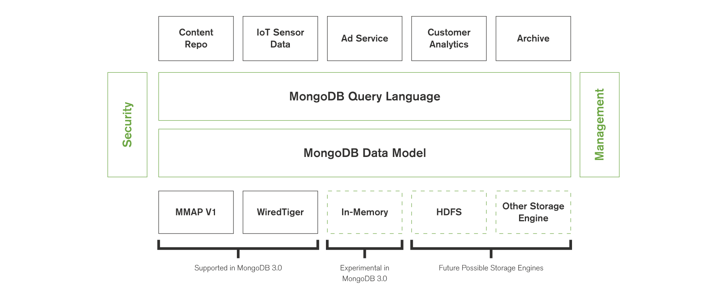

# MongoDB Interview Questions ( v4.4 )

## Table of Contents


## What are NoSQL databases? What are the different types of NoSQL databases?

NoSQL is a non-relational DBMS, that does not require a fixed schema, avoids joins, and is easy to scale. The purpose of using a NoSQL database is for distributed data stores with humongous data storage needs. NoSQL is used for Big data and real-time web apps.

**Types of NoSQL Databases**

* Document databases
* Key-value stores
* Column-oriented databases
* Graph databases

### Document databases

A document database stores data in JSON, BSON , or XML documents. In a document database, documents can be nested. Particular elements can be indexed for faster querying.

Documents can be stored and retrieved in a form that is much closer to the data objects used in applications, which means less translation is required to use the data in an application. SQL data must often be assembled and disassembled when moving back and forth between applications and storage.

**Example:**  Amazon SimpleDB, CouchDB, MongoDB, Riak, Lotus Notes are popular Document originated DBMS systems.

<p align="center">
  
</p>

### Key-value Stores

Data is stored in key/value pairs. It is designed in such a way to handle lots of data and heavy load. Key-value pair storage databases store data as a hash table where each key is unique, and the value can be a JSON, BLOB(Binary Large Objects), string, etc.

**Example:** of key-value stores are Redis, Voldemort, Riak, and Amazon\'s DynamoDB.

<p align="center">
  
</p>

### Column-Oriented Databases

Column-oriented databases work on columns and are based on BigTable paper by Google. Every column is treated separately. The values of single column databases are stored contiguously.

They deliver high performance on aggregation queries like SUM, COUNT, AVG, MIN, etc. as the data is readily available in a column.

**Example:** Column-based NoSQL databases are widely used to manage data warehouses, business intelligence, CRM, Library card catalogs, HBase, Cassandra, HBase, Hypertable are examples of a column-based database.

<p align="center">
  
</p>

### Graph Databases

A graph type database stores entities as well the relations amongst those entities. The entity is stored as a node with the relationship as edges. An edge gives a relationship between nodes. Every node and edge has a unique identifier.

Compared to a relational database where tables are loosely connected, a Graph database is a multi-relational in nature. Traversing relationships as fast as they are already captured into the DB, and there is no need to calculate them.

Graph base databases mostly used for social networks, logistics, spatial data.

**Example:** Neo4J, Infinite Graph, OrientDB, FlockDB are some popular graph-based databases.

<p align="center">
  
</p>

## What is MongoDB?

**MongoDB** is a document-oriented NoSQL database used for high volume data storage. Instead of using tables and rows as in the traditional relational databases, MongoDB makes use of collections and documents. Documents consist of key-value pairs which are the basic unit of data in MongoDB. Collections contain sets of documents and function which is the equivalent of relational database tables.

**Key Features**

* Document Oriented and NoSQL database.
* Supports Aggregation
* Uses BSON format
* Sharding (Helps in Horizontal Scalability)
* Supports Ad Hoc Queries
* Schema Less
* Capped Collection
* Indexing (Any field in MongoDB can be indexed)
* MongoDB Replica Set (Provides high availability)
* Supports Multiple Storage Engines

**Key Components**

**1. _id**: The `_id` field represents a unique value in the MongoDB document. The `_id` field is like the document\'s primary key. If you create a new document without an `_id` field, MongoDB will automatically create the field.

**2. Collection**:  This is a grouping of MongoDB documents. A collection is the equivalent of a table which is created in any other RDMS such as Oracle.

**3. Cursor**: This is a pointer to the result set of a query. Clients can iterate through a cursor to retrieve results.

**4. Database**: This is a container for collections like in RDMS wherein it is a container for tables. Each database gets its own set of files on the file system. A MongoDB server can store multiple databases.

**5. Document**: A record in a MongoDB collection is basically called a document. The document, in turn, will consist of field name and values.

**6. Field**: A name-value pair in a document. A document has zero or more fields. Fields are analogous to columns in relational databases.

**Example:**

Connecting MongoDB Cloud using MongoDB Compass

<p align="center">
   
</p>


## What are Indexes in MongoDB?

Indexes support the efficient execution of queries in MongoDB. Without indexes, MongoDB must perform a collection scan, i.e. scan every document in a collection, to select those documents that match the query statement. If an appropriate index exists for a query, MongoDB can use the index to limit the number of documents it must inspect.

Indexes are special data structures that store a small portion of the collection\'s data set in an easy to traverse form. The index stores the value of a specific field or set of fields, ordered by the value of the field. The ordering of the index entries supports efficient equality matches and range-based query operations. In addition, MongoDB can return sorted results by using the ordering in the index.

**Example**

The `createIndex()` method only creates an index if an index of the same specification does not already exist. The following example ( using Node.js ) creates a single key descending index on the name field:

```js
collection.createIndex( { name : -1 }, function(err, result) {
   console.log(result);
   callback(result);
}
```

<div align="right">
    <b><a href="#">↥ back to top</a></b>
</div>

## What are the types of Indexes available in MongoDB?

MongoDB supports the following types of the index for running a query.

**1. Single Field Index**

MongoDB supports user-defined indexes like single field index. A single field index is used to create an index on the single field of a document. With single field index, MongoDB can traverse in ascending and descending order. By default, each collection has a single field index automatically created on the `_id` field, the primary key.

**Example**

```js
{
  "_id": 1,
  "person": { name: "Alex", surname: "K" },
  "age": 29,
  "city": "New York"
}
```

We can define, a single field index on the age field.

```js
db.people.createIndex( {age : 1} ) // creates an ascending index

db.people.createIndex( {age : -1} ) // creates a descending index
```

With this kind of index we can improve all the queries that find documents with a condition and the age field, like the following:

```js
db.people.find( { age : 20 } )
db.people.find( { name : "Alex", age : 30 } )
db.people.find( { age : { $gt : 25} } )
```

**2. Compound Index**

A compound index is an index on multiple fields. Using the same people collection we can create a compound index combining the city and age field.

```js
db.people.createIndex( {city: 1, age: 1, person.surname: 1  } )
```

In this case, we have created a compound index where the first entry is the value of the city field, the second is the value of the age field, and the third is the person.name. All the fields here are defined in ascending order.

Queries such as the following can benefit from the index:

```js
db.people.find( { city: "Miami", age: { $gt: 50 } } )
db.people.find( { city: "Boston" } )
db.people.find( { city: "Atlanta", age: {$lt: 25}, "person.surname": "Green" } )
```

**3. Multikey Index**

This is the index type for arrays. When creating an index on an array, MongoDB will create an index entry for every element.

**Example**

```js
{
   "_id": 1,
   "person": { name: "John", surname: "Brown" },
   "age": 34,
   "city": "New York",
   "hobbies": [ "music", "gardening", "skiing" ]
 }
```

The multikey index can be created as:

```js
db.people.createIndex( { hobbies: 1} )
```

Queries such as these next examples will use the index:

```js
db.people.find( { hobbies: "music" } )
db.people.find( { hobbies: "music", hobbies: "gardening" } )
```

**4. Geospatial Index**

GeoIndexes are a special index type that allows a search based on location, distance from a point and many other different features. To query geospatial data, MongoDB supports two types of indexes – `2d indexes` and `2d sphere indexes`. 2d indexes use planar geometry when returning results and 2dsphere indexes use spherical geometry to return results.

**5. Text Index**

It is another type of index that is supported by MongoDB. Text index supports searching for string content in a collection. These index types do not store language-specific stop words (e.g. "the", "a", "or"). Text indexes restrict the words in a collection to only store root words.

**Example**

Let\'s insert some sample documents.

```js
var entries = db.people("blogs").entries;
entries.insert( {
  title : "my blog post",
  text : "i am writing a blog. yay",
  site: "home",
  language: "english" });
entries.insert( {
  title : "my 2nd post",
  text : "this is a new blog i am typing. yay",
  site: "work",
  language: "english" });
entries.insert( {
  title : "knives are Fun",
  text : "this is a new blog i am writing. yay",
  site: "home",
  language: "english" });
```

Let\'s define create the text index.

```js
var entries = db.people("blogs").entries;
entries.ensureIndex({title: "text", text: "text"}, { weights: {
    title: 10,
    text: 5
  },
  name: "TextIndex",
  default_language: "english",
  language_override: "language" });
```

Queries such as these next examples will use the index:

```js
var entries = db.people("blogs").entries;
entries.find({$text: {$search: "blog"}, site: "home"})
```

**6. Hashed Index**

MongoDB supports hash-based sharding and provides hashed indexes. These indexes are the hashes of the field value. Shards use hashed indexes and create a hash according to the field value to spread the writes across the sharded instances.

<div align="right">
    <b><a href="#">↥ back to top</a></b>
</div>

##  Explain Index Properties in MongoDB?

**1. TTL Indexes**

TTL ( **Time To Live** ) is a special option that we can apply only to a single field index to permit the automatic deletion of documents after a certain time.

During index creation, we can define an expiration time. After that time, all the documents that are older than the expiration time will be removed from the collection. This kind of feature is very useful when we are dealing with data that don\'t need to persist in the database ( eg. `session data` ).

**Example**

```js
db.sessionlog.createIndex( { "lastUpdateTime": 1 }, { expireAfterSeconds: 1800 } )
```

In this case, MongoDB will drop the documents from the collection automatically once half an hour (1800 seconds) has passed since the value in **lastUpdateTime** field.

**Restrictions**

* Only single field indexes can have the TTL option
* the `_id` single field index cannot support the TTL option
* the indexed field must be a date type
* a capped collection cannot have a TTL index

**2. Partial indexes**

A partial index is an index that contains only a subset of the values based on a filter rule. They are useful in cases where:

* The index size can be reduced
* We want to index the most relevant and used values in the query conditions
* We want to index the most selective values of a field

**Example**

```js
db.people.createIndex(
   { "city": 1, "person.surname": 1 },
   { partialFilterExpression: { age : { $lt: 30 } } }
)
```

We have created a compound index on city and person.surname but only for the documents with age less than 30.
In order for the partial index to be used the queries must contain a condition on the age field.

```js
db.people.find( { city: "New Tork", age: { $eq: 20} } )
```

**3. Sparse indexes**

Sparse indexes are a subset of partial indexes. A sparse index only contains elements for the documents that have the indexed field, even if it is null.

Since MongoDB is a schemaless database, the documents in a collection can have different fields, so an indexed field may not be present in some of them.

**Example**

To create such an index use the sparse option:

```js
db.people.createIndex( { city: 1 }, { sparse: true } )
```

In this case, we are assuming there could be documents in the collection with the field city missing. Sparse indexes are based on the existence of a field in the documents and are useful to reduce the size of the index.

**4. Unique indexes**

MongoDB can create an index as unique. An index defined this way cannot contain duplicate entries.

**Example**

```js
db.people.createIndex( { city: 1 }, { unique: true } )
```

Uniqueness can be defined for compound indexes too.

```js
db.people.createIndex( { city: 1, person.surname: 1}, { unique: true } )
```

By default, the index on `_id` is automatically created as unique.

<div align="right">
    <b><a href="#">↥ back to top</a></b>
</div>

## How many indexes does MongoDB create by default for a new collection?

By default MongoDB creates a unique index on the `_id` field during the creation of a collection. The `_id` index prevents clients from inserting two documents with the same value for the `_id` field.

<div align="right">
    <b><a href="#">↥ back to top</a></b>
</div>

## Can you create an index in an array field in MongoDB?

Yes, To index a field that holds an array value, MongoDB creates an index key for each element in the array. Multikey indexes can be constructed over arrays that hold both scalar values (e.g. strings, numbers) and nested documents. MongoDB automatically creates a multikey index if any indexed field is an array.

Syntax

```js
db.collection.createIndex( { <field>: < 1 or -1 > } )
```

For example, consider an inventory collection that contains the following documents:

```js
{ _id: 10, type: "food", item: "aaa", ratings: [ 5, 8, 9 ] }
{ _id: 11, type: "food", item: "bbb", ratings: [ 5, 9 ] }
{ _id: 12, type: "food", item: "ccc", ratings: [ 9, 5, 8, 4, 7 ] }
```

The collection has a multikey index on the ratings field:

```js
db.inventory.createIndex( { ratings: 1 } )
```

The following query looks for documents where the ratings field is the array [ 5, 9 ]:

```js
db.inventory.find( { ratings: [ 5, 9 ] } )
```

MongoDB can use the multikey index to find documents that have 5 at any position in the ratings array. Then, MongoDB retrieves these documents and filters for documents whose ratings array equals the query array [ 5, 9 ].

<div align="right">
    <b><a href="#">↥ back to top</a></b>
</div>

## Why does Profiler use in MongoDB?

The database profiler captures data information about read and write operations, cursor operations, and database commands. The database profiler writes data in the `system.profile` collection, which is a capped collection.

The database profiler collects detailed information about Database Commands executed against a running mongod instance. This includes CRUD operations as well as configuration and administration commands.

Profiler has 3 profiling levels.

* **Level 0** - Profiler will not log any data
* **Level 1** - Profiler will log only slow operations above some threshold
* **Level 2** - Profiler will log all the operations

**1. To get current profiling level.**

```bash
db.getProfilingLevel()

// Output
0
```

**2. To check current profiling status**

```bash
db.getProfilingStatus()


// Output
{ "was" : 0, "slowms" : 100 }
```

**3. To set profiling level**

```bash
db.setProfilingLevel(1, 40)

// Output
{ "was" : 0, "slowms" : 100, "ok" : 1 }
```

<div align="right">
    <b><a href="#">↥ back to top</a></b>
</div>

## How to remove attribute from MongoDB Object?

**$unset**

The `$unset` operator deletes a particular field. If the field does not exist, then `$unset` does nothing. When used with `$` to match an array element, `$unset` replaces the matching element with `null` rather than removing the matching element from the array. This behavior keeps consistent the array size and element positions.

syntax:

```js
{ $unset: { <field1>: "", ... } }
```

**Example:**

delete the `properties.service` attribute from all records on this collection.

```js
db.collection.update(
    {},
    {
        $unset : {
            "properties.service" : 1
        }
    },
    {
        multi: true
    }
);
```

**To verify they have been deleted you can use:**

```js
db.collection.find(
    {
        "properties.service" : {
            $exists : true
         }
    }
).count(true);
```

<div align="right">
    <b><a href="#">↥ back to top</a></b>
</div>

## What is "Namespace" in MongoDB?

MongoDB stores BSON (Binary Interchange and Structure Object Notation) objects in the collection. The concatenation of the collection name and database name is called a namespace

<div align="right">
    <b><a href="#">↥ back to top</a></b>
</div>

## What is Replication in Mongodb?

Replication exists primarily to offer data redundancy and high availability. It maintain the durability of data by keeping multiple copies or replicas of that data on physically isolated servers. Replication allows to increase data availability by creating multiple copies of data across servers. This is especially useful if a server crashes or hardware failure.

With MongoDB, replication is achieved through a **Replica Set**. Writer operations are sent to the primary server (node), which applies the operations across secondary servers, replicating the data. If the primary server fails (through a crash or system failure), one of the secondary servers takes over and becomes the new primary node via election. If that server comes back online, it becomes a secondary once it fully recovers, aiding the new primary node.

<div align="right">
    <b><a href="#">↥ back to top</a></b>
</div>

## What is Replica Set in MongoDB?

It is a group of mongo processes that maintain same data set. Replica sets provide redundancy and high availability, and are the basis for all production deployments. A replica set contains a primary node and multiple secondary nodes.

The primary node receives all write operations. A replica set can have only one primary capable of confirming writes with `{ w: "majority" }` write concern; although in some circumstances, another mongod instance may transiently believe itself to also be primary.

The secondaries replicate the primary\'s oplog and apply the operations to their data sets such that the secondaries\' data sets reflect the primary\'s data set. If the primary is unavailable, an eligible secondary will hold an election to elect itself the new primary.

<p align="center">
  
</p>

<div align="right">
    <b><a href="#">↥ back to top</a></b>
</div>

## How does MongoDB ensure high availability?

**High Availability (HA)** refers to the improvement of system and app availability by minimizing the downtime caused by routine maintenance operations (planned) and sudden system crashes (unplanned).

**Replica Set**

The replica set mechanism of MongoDB has two main purposes:

* One is for data redundancy for failure recovery. When the hardware fails, or the node is down for other reasons, you can use a replica for recovery.
* The other purpose is for read-write splitting. It routes the reading requests to the replica to reduce the reading pressure on the primary node.

MongoDB automatically maintains replica sets, multiple copies of data that are distributed across servers, racks and data centers. Replica sets help prevent database downtime using native replication and automatic failover.

A replica set consists of multiple replica set members. At any given time, one member acts as the primary member, and the other members act as secondary members. If the primary member fails for any reason (e.g., hardware failure), one of the secondary members is automatically elected to primary and begins to process all reads and writes.

<div align="right">
    <b><a href="#">↥ back to top</a></b>
</div>

## What is an Embedded MongoDB Document?

An embedded, or nested, MongoDB Document is a normal document that is nested inside another document within a MongoDB collection. Embedding connected data in a single document can reduce the number of read operations required to obtain data. In general, we should structure our schema so that application receives all of its required information in a single read operation.

**Example:**

In the normalized data model, the address documents contain a reference to the patron document.

```js
// patron document
{
   _id: "joe",
   name: "Joe Bookreader"
}

// address documents
{
   patron_id: "joe", // reference to patron document
   street: "123 Fake Street",
   city: "Faketon",
   state: "MA",
   zip: "12345"
}

{
   patron_id: "joe",
   street: "1 Some Other Street",
   city: "Boston",
   state: "MA",
   zip: "12345"
}
```

Embedded documents are particularly useful when a **one-to-many** relationship exists between documents. In the example shown above, we see that a single customer has multiple addresses associated with him. The nested document structure makes it easy to retrieve complete address information about this customer with just a single query.

<div align="right">
    <b><a href="#">↥ back to top</a></b>
</div>

## How can you achieve primary key - foreign key relationships in MongoDB?

The primary key-foreign key relationship can be achieved by embedding one document inside the another. As an example, a department document can have its employee document(s).

<div align="right">
    <b><a href="#">↥ back to top</a></b>
</div>

## When should we embed one document within another in MongoDB?

You should consider embedding documents for:

* *contains* relationships between entities
* One-to-many relationships
* Performance reasons

<div align="right">
    <b><a href="#">↥ back to top</a></b>
</div>

## How is data stored in MongoDB?

In MongoDB, Data is stored in BSON documents (short for `Bin­ary JSON`). These documents are stored in MongoDB in JSON (JavaScript Object Notation) format. JSON documents support embedded fields, so related data and lists of data can be stored with the document instead of an external table. Documents contain one or more fields, and each field contains a value of a specific data type, including arrays, binary data and sub-documents. Documents that tend to share a similar structure are organized as collections.

JSON is formatted as name/value pairs. In JSON documents, field names and values are separated by a colon, field name and value pairs are separated by commas, and sets of fields are encapsulated in "curly braces" ({}).

**Example:**

```js
{
  "name": "notebook",
  "qty": 50,
  "rating": [ { "score": 8 }, { "score": 9 } ],
  "size": { "height": 11, "width": 8.5, "unit": "in" },
  "status": "A",
  "tags": [ "college-ruled", "perforated"]
}
```

<div align="right">
    <b><a href="#">↥ back to top</a></b>
</div>

## What are the differences between MongoDB and SQL-SERVER?

* The MongoDB store the data in documents with JSON format but SQL store the data in Table format.
* The MongoDB provides high performance, high availability, easy scalability etc.  rather than SQL Server.
* In the MongoDB, we can change the structure simply by adding, removing column from the existing documents.

**MongoDB and SQL Server Comparision Table**

| Base of Comparison | MS SQL Server      | MongoDB                                                  |
| ------------------ | ------------------ | -------------------------------------------------------- |
| Storage Model      | RDBMS              | Document-Oriented                                        |
| Joins              | Yes                | No                                                       |
| Transaction        | ACID               | Multi-document ACID Transactions with snapshot isolation |
| Agile practices    | No                 | Yes                                                      |
| Data Schema        | Fixed              | Dynamic                                                  |
| Scalability        | Vertical           | Horizontal                                               |
| Map Reduce         | No                 | Yes                                                      |
| Language           | SQL query language | JSON Query Language                                      |
| Secondary index    | Yes                | Yes                                                      |
| Triggers           | Yes                | Yes                                                      |
| Foreign Keys       | Yes                | No                                                       |
| Concurrency        | Yes                | yes                                                      |
| XML Support        | Yes                | No                                                       |


<div align="right">
    <b><a href="#">↥ back to top</a></b>
</div>

## How can you achieve transaction and locking in MongoDB?

In MongoDB (4.2), an operation on a single document is atomic. For situations that require atomicity of reads and writes to multiple documents (in a single or multiple collections), MongoDB supports multi-document transactions. With distributed transactions, transactions can be used across multiple operations, collections, databases, documents, and shards.

MongoDB allows multiple clients to read and write the same data. In order to ensure consistency, it uses locking and other concurrency control measures to prevent multiple clients from modifying the same piece of data simultaneously.

MongoDB uses **multi-granularity locking** that allows operations to lock at the global, database or collection level, and allows for individual storage engines to implement their own concurrency control below the collection level (e.g., at the document-level in WiredTiger). MongoDB uses reader-writer locks that allow concurrent readers shared access to a resource, such as a database or collection.

The lock modes are represented as follows:

| Lock Mode | Description                            |
| --------- | -------------------------------------- |
| R         | Represents Shared (S) lock.            |
| W         | Represents Exclusive (X) lock.         |
| r         | Represents Intent Shared (IS) lock.    |
| w         | Represents Intent Exclusive (IX) lock. |

**Example:**

The following example highlights the key components of the transactions API

```js
const client = new MongoClient(uri);
await client.connect();

// Prereq: Create collections.

await client.db('mydb1').collection('foo').insertOne({ abc: 0 }, { w: 'majority' });

await client.db('mydb2').collection('bar').insertOne({ xyz: 0 }, { w: 'majority' });

// Step 1: Start a Client Session
const session = client.startSession();

// Step 2: Optional. Define options to use for the transaction
const transactionOptions = {
  readPreference: 'primary',
  readConcern: { level: 'local' },
  writeConcern: { w: 'majority' }
};

// Step 3: Use withTransaction to start a transaction, execute the callback, and commit (or abort on error)
// Note: The callback for withTransaction MUST be async and/or return a Promise.
try {
  await session.withTransaction(async () => {
    const coll1 = client.db('mydb1').collection('foo');
    const coll2 = client.db('mydb2').collection('bar');

    // Important:: You must pass the session to the operations

    await coll1.insertOne({ abc: 1 }, { session });
    await coll2.insertOne({ xyz: 999 }, { session });
  }, transactionOptions);
} finally {
   await session.endSession();
   await client.close();
}
```

<div align="right">
    <b><a href="#">↥ back to top</a></b>
</div>

## When to Use MongoDB Rather than MySQL?

**1. MongoDB**

MongoDB is one of the most popular document-oriented databases under the banner of NoSQL database. It employs the format of key-value pairs, here called document store. Document stores in MongoDB are created is stored in BSON files which are, in fact, a little-modified version of JSON files and hence all JS are supported.

It offers greater efficiency and reliability which in turn can meet your storage capacity and speed demands. The schema-free implementation of MongoDB eliminates the prerequisites of defining a fixed structure. These models allow hierarchical relationships representation and facilitate the ability to change the structure of the record.

**Pros**

* MongoDB has a lower latency per query & spends less CPU time per query because it is doing a lot less work (e.g. no joins, transactions). As a result, it can handle a higher load in terms of queries per second.
* MongoDB is easier to shard (use in a cluster) because it doesn\'t have to worry about transactions and consistency.
* MongoDB has a faster write speed because it does not have to worry about transactions or rollbacks (and thus does not have to worry about locking).
* It supports many Features like automatic repair, easier data distribution, and simpler data models make administration and tuning requirements lesser in NoSQL.
* NoSQL databases are cheap and open source.
* NoSQL database support caching in system memory so it increases data output performance.

**Cons**

* MongoDB does not support transactions.
* In general, MongoDB creates more work (e.g. more CPU cost) for the client server. For example, to join data one has to issue multiple queries and do the join on the client.
* No Stored Procedures in mongo dB (NoSQL database).

**Reasons to Use a NoSQL Database**

* **Storing large volumes of data without structure**: A NoSQL database doesn\'t limit storable data types. Plus, you can add new types as business needs change.
* **Using cloud computing and storage**: Cloud-based storage is a great solution, but it requires data to be easily spread across multiple servers for scaling. Using affordable hardware on-site for testing and then for production in the cloud is what NoSQL databases are designed for.
* **Rapid development**: If you are developing using modern agile methodologies, a relational database will slow you down. A NoSQL database doesn\'t require the level of preparation typically needed for relational databases.

**2. MySQL**

MySQL is a popular open-source relational database management system (RDBMS) that is developed, distributed and supported by Oracle Corporation. MySQL stores data in tables and uses structured query language (SQL) for database access. It uses Structured Query Language SQL to access and transfer the data and commands such as 'SELECT', 'UPDATE', 'INSERT' and 'DELETE' to manage it.

Related information is stored in different tables but the concept of JOIN operations simplifies the process of correlating it and performing queries across multiple tables and minimize the chances of data duplication. It follows the ACID (Atomic, Consistent, Isolated and Durable) model. This means that once a transaction is complete, the data remains consistent and stable on the disc which may include distinct multiple memory locations.

**Pros**

* SQL databases are table based databases.
* Data store in rows and columns
* Each row contains a unique instance of data for the categories defined by the columns.
* Provide facility primary key, to uniquely identify the rows.

**Cons**

* Users have to scale relational database on powerful servers that are expensive and difficult to handle. To scale relational database, it has to be distributed on to multiple servers. Handling tables across different servers is difficult.
* In SQL server\'s data has to fit into tables anyhow. If your data doesn\'t fit into tables, then you need to design your database structure that will be complex and again difficult to handle.

<div align="right">
    <b><a href="#">↥ back to top</a></b>
</div>

## How MongoDB supports ACID transactions and locking functionalities?

ACID stands that any update is:

* **Atomic:** it either fully completes or it does not
* **Consistent:** no reader will see a "partially applied" update
* **Isolated:** no reader will see a "dirty" read
* **Durable:** (with the appropriate write concern)

MongoDB, has always supported ACID transactions in a single document and, when leveraging the document model appropriately, many applications don\'t need ACID guarantees across multiple documents.

MongoDB is a document based  NoSQL database with a flexible schema. Transactions are not operations that should be executed for every write operation  since they incur a greater performance cost over a single document writes. With a document based structure and denormalized data model, there will be a minimized need for transactions. Since MongoDB allows document embedding, you don\'t necessarily need to use a transaction to meet a write operation.

MongoDB version 4.0 provides **multi-document transaction** support for replica set deployments only and probably the version 4.2 will extend support for sharded deployments.

**Example:** Multi-Document ACID Transactions in MongoDB

These are multi-statement operations that need to be executed sequentially without affecting each other. For example below we can create two transactions, one to add a user and another to update a user with a field of age.

```js
$session.startTransaction()

   db.users.insert({_id: 6, name: "John"})

   db.users.updateOne({_id: 3, {$set: {age:26} }})

session.commit_transaction()
```

Transactions can be applied to operations against multiple documents contained in one or many collection/database. Any changes due to document transaction do not impact performance for workloads not related or do not require them. Until the transaction is committed, uncommitted writes are neither replicated to the secondary nodes nor are they readable outside the transactions.

<div align="right">
    <b><a href="#">↥ back to top</a></b>
</div>

## What are the best practices for MongoDB Transactions?

The multi-document transactions are only supported in the `WiredTiger` storage engine. For a single ACID transaction, if you try performing an excessive number of operations, it can result in high pressure on the WiredTiger cache. The cache is always dictated to maintain state for all subsequent writes since the oldest snapshot was created. This means new writes will accumulate in the cache throughout the duration of the transaction and will be flushed only after transactions currently running on old snapshots are committed or aborted.

For the best database performance on the transaction, developers should consider:

1. Always modify a small number of documents in a transaction. Otherwise, you will need to break the transaction into different parts and process the documents in different batches. At most, process 1000 documents at a time.

2. Temporary exceptions such as awaiting to elect primary and transient network hiccups may result in abortion of the transaction. Developers should establish a logic to retry the transaction if the defined errors are presented.

3. Configure optimal duration for the execution of the transaction from the default 60 seconds provided by MongoDB. Besides, employ indexing so that it can allow fast data access within the transaction.

4. Decompose your transaction into a small set of operation so that it fits the 16MB size constraints. Otherwise, if the operation together with oplog description exceed this limit, the transaction will be aborted.

5. All data relating to an entity should be stored in a single, rich document structure. This is to reduce the number of documents that are to be cached when different fields are going to be changed.

<div align="right">
    <b><a href="#">↥ back to top</a></b>
</div>

## Explain limitations of MongoDB Transactions?

MongoDB transactions can exist only for relatively short time periods.  By default, a transaction must span no more than one minute of clock time.  This limitation results from the underlying MongoDB implementation. MongoDB uses MVCC, but unlike databases such as Oracle, the “older” versions of data are kept only in memory.

1. You cannot create or drop a collection inside a transaction.
2. Transactions cannot make writes to a capped collection
3. Transactions take plenty of time to execute and somehow they can slow the performance of the database.
4. Transaction size is limited to 16MB requiring one to split any that tends to exceed this size into smaller transactions.
5. Subjecting a large number of documents to a transaction may exert excessive pressure on the WiredTiger engine and since it relies on the snapshot capability, there will be a retention of large unflushed operations in memory. This renders some performance cost on the database.

<div align="right">
    <b><a href="#">↥ back to top</a></b>
</div>

## Should I normalize my data before storing it in MongoDB?

Data used by multiple documents can either be embedded (denormalized) or referenced (normalized). Normalization, which is increasing the complexity of the schema by splitting tables into multiple smaller ones to reduce the data redundancy( 1NF, 2NF, 3NF).

But Mongo follows the exact opposite way of what we do with SQL. In MongoDB, data normalization is not requried. Indeed we need to de-normalize and fit it into a collection of multiple documents.

**Example:** Let\'s say we have three tables

* Table - 1 : ColumnA, ColumnB (primary key)
* Table - 2 : ColumnC (Foreign key), ColumnD (primary key)
* Table - 3 : ColumnE (foreign key), ColumnF

In this case, mongoDB document structure should be as follows.

```js
{
    ColumnA : ValueA,
    ColumnB : ValueB,
    Subset1 : [{
       ColumnC : ValueC,
       ColumnD : ValueD,
       Subset2 : [{
           ColumnE : ValueE,
           ColumnF : ValueF
       }]
    }]
}
```

<div align="right">
    <b><a href="#">↥ back to top</a></b>
</div>

## What is upsert operation in MongoDB?

Upsert operation in MongoDB is utilized to save document into collection. If document matches query criteria then it will perform update operation otherwise it will insert a new document into collection.

Upsert operation is useful while importing data from external source which will update existing documents if matched otherwise it will insert new documents into collection.

**Example:** Upsert option set for update

This operation first searches for the document if not present then inserts the new document into the database.

```js

> db.car.update(
...    { name: "Qualis" },
...    {
...       name: "Qualis",
...       speed: 50
...    },
...    { upsert: true }
... )
WriteResult({
	"nMatched" : 0,
	"nUpserted" : 1,
	"nModified" : 0,
	"_id" : ObjectId("548d3a955a5072e76925dc1c")
})
```

The car with the name Qualis is checked for existence and if not, a document with car name "Qualis" and speed 50 is inserted into the database. The nUpserted with value "1" indicates a new document is inserted.

<div align="right">
    <b><a href="#">↥ back to top</a></b>
</div>

## Is there an "upsert" option in the mongodb insert command?

The `db.collection.insert()` provides no upsert possibility. Instead, mongo insert inserts a new document into a collection. Upsert is only possible using `db.collection.update()` and `db.collection.save()`.

<div align="right">
    <b><a href="#">↥ back to top</a></b>
</div>

## What is oplog?

The OpLog (Operations Log) is a special capped collection that keeps a rolling record of all operations that modify the data stored in databases.

MongoDB applies database operations on the primary and then records the operations on the primary\'s oplog. The secondary members then copy and apply these operations in an asynchronous process. All replica set members contain a copy of the oplog, in the **local.oplog.rs** collection, which allows them to maintain the current state of the database.

Each operation in the oplog is idempotent. That is, oplog operations produce the same results whether applied once or multiple times to the target dataset.

**Example:** Querying The OpLog

```js
MongoDB shell version: 2.0.4
connecting to: mongodb:27017/test
PRIMARY> use local
PRIMARY> db.oplog.rs.find()
```

<div align="right">
    <b><a href="#">↥ back to top</a></b>
</div>

## Does MongoDB pushes the writes to disk immediately or lazily?

MongoDB pushes the data to disk lazily. It updates the immediately written to the journal but writing the data from journal to disk happens lazily.

<div align="right">
    <b><a href="#">↥ back to top</a></b>
</div>

## How to perform a delete operation in MongoDB?

MongoDB\'s `db.collection.deleteMany()` and `db.collection.deleteOne()` method is used to delete documents from the collection. Delete operations do not drop indexes, even if deleting all documents from a collection. All write operations in MongoDB are atomic on the level of a single document.

**Example:**

```js
// Create Inventory Collection
db.inventory.insertMany( [
   { item: "journal", qty: 25, size: { h: 14, w: 21, uom: "cm" }, status: "A" },
   { item: "notebook", qty: 50, size: { h: 8.5, w: 11, uom: "in" }, status: "P" },
   { item: "paper", qty: 100, size: { h: 8.5, w: 11, uom: "in" }, status: "D" },
   { item: "planner", qty: 75, size: { h: 22.85, w: 30, uom: "cm" }, status: "D" },
   { item: "postcard", qty: 45, size: { h: 10, w: 15.25, uom: "cm" }, status: "A" },
] );


// Delete Commands
db.inventory.deleteMany({}) // Delete All Documents

db.inventory.deleteMany({ status : "A" }) // Delete All Documents that Match a Condition

db.inventory.deleteOne( { status: "D" } ) // Delete Only One Document that Matches a Condition
```

<div align="right">
    <b><a href="#">↥ back to top</a></b>
</div>

## If you remove a document from database, does MongoDB remove it from disk?

Yes. If you remove a document from database, MongoDB will remove it from disk too.

<div align="right">
    <b><a href="#">↥ back to top</a></b>
</div>

## Explain the structure of ObjectID in MongoDB?

The **ObjectId(`<hexadecimal>`)** class is the default primary key for a MongoDB document and is usually found in the `_id` field in an inserted document. It returns a new ObjectId value. The 12-byte ObjectId value consists of:

* a 4-byte timestamp value, representing the ObjectId\'s creation, measured in seconds since the Unix epoch
* a 5-byte random value
* a 3-byte incrementing counter, initialized to a random value

<p align="center">
  
</p>

While the BSON format itself is little-endian, the timestamp and counter values are big-endian, with the most significant bytes appearing first in the byte sequence.

**Create ObjectId**

To create a new objectID manually within the MongoDB we can declare `objectId()` as a method.

```js
> newObjectId = ObjectId();

// Output
ObjectId("5349b4ddd2781d08c09890f3")
```

**MongoDB provides three methods for ObjectId**

| Method                  | Description                                                                            |
| ----------------------- | -------------------------------------------------------------------------------------- |
| ObjectId.getTimestamp() | Returns the timestamp portion of the object as a Date.                                 |
| ObjectId.toString()     | Returns the JavaScript representation in the form of a string literal "ObjectId(...)". |
| ObjectId.valueOf()      | Returns the representation of the object as a hexadecimal string.                      |

<div align="right">
    <b><a href="#">↥ back to top</a></b>
</div>

## What is a covered query in MongoDB?

The MongoDB covered query is one which uses an index and does not have to examine any documents. An index will cover a query if it satisfies the following conditions:

* All fields in a query are part of an index.
* All fields returned in the results are of the same index.
* No fields in the query are equal to null

Since all the fields present in the query are part of an index, MongoDB matches the query conditions and returns the result using the same index without actually looking inside the documents.

**Example:**

A collection inventory has the following index on the type and item fields:

```js
db.inventory.createIndex( { type: 1, item: 1 } )
```

This index will cover the following operation which queries on the type and item fields and returns only the item field:

```js
db.inventory.find(
   { type: "food", item:/^c/ },
   { item: 1, _id: 0 }
)
```

<div align="right">
    <b><a href="#">↥ back to top</a></b>
</div>

## Why MongoDB is not preferred over a 32-bit system?

When running a 32-bit system build of MongoDB, the total storage size for the server, including data and indexes, is 2 gigabytes. The reason for this is that the MongoDB storage engine uses memory-mapped files for performance.

If you are running a 64-bit build of MongoDB, there is virtually no limit to storage size.

<div align="right">
    <b><a href="#">↥ back to top</a></b>
</div>

## Can one MongoDB operation lock more than one database?

Yes. Operations like `db.copyDatabase()`, `db.repairDatabase()`, etc. can lock more than one databases involved.

<div align="right">
    <b><a href="#">↥ back to top</a></b>
</div>

## What is Sharding in MongoDB?

**Sharding** is a method for distributing data across multiple machines. MongoDB uses sharding to support deployments with very large data sets and high throughput operations.

Database systems with large data sets or high throughput applications can challenge the capacity of a single server. For example, high query rates can exhaust the CPU capacity of the server. Working set sizes larger than the system\'s RAM stress the I/O capacity of disk drives. There are two methods for addressing system growth: vertical and horizontal scaling.

**1. Vertical Scaling**

Vertical Scaling involves increasing the capacity of a single server, such as using a more powerful CPU, adding more RAM, or increasing the amount of storage space.

**2. Horizontal Scaling**

Horizontal Scaling involves dividing the system dataset and load over multiple servers, adding additional servers to increase capacity as required. While the overall speed or capacity of a single machine may not be high, each machine handles a subset of the overall workload, potentially providing better efficiency than a single high-speed high-capacity server.

<p align="center">
  
</p>

MongoDB supports horizontal scaling through `sharding`. A MongoDB sharded cluster consists of the following components:

* **Shards**: Each shard contains a subset of the sharded data. Each shard can be deployed as a replica set.
* **Mongos**: The mongos acts as a query router, providing an interface between client applications and the sharded  cluster. Starting in MongoDB 4.4, mongos can support hedged reads to minimize latencies.
* **Config Servers**: Config servers store metadata and configuration settings for the cluster.

<div align="right">
    <b><a href="#">↥ back to top</a></b>
</div>

## What is Aggregation in MongoDB?

Aggregation in MongoDB is an operation used to process the data that returns the computed results. Aggregation basically groups the data from multiple documents and operates in many ways on those grouped data in order to return one combined result.

Aggregate function groups the records in a collection, and can be used to provide total number(sum), average, minimum, maximum etc out of the group selected. In order to perform the aggregate function in MongoDB, aggregate () is the function to be used.

Syntax

```js
db.collection_name.aggregate(aggregate_operation)
```

MongoDB provides three ways to perform aggregation:

* the aggregation pipeline,
* the map-reduce function,
* and single purpose aggregation methods and commands.

MongoDB\'s aggregation framework is modeled on the concept of data processing pipelines. Documents enter a multi-stage pipeline that transforms the documents into an aggregated result.

**Example**

```js
db.orders.aggregate([
   { $match: { status: "A" } },
   { $group: { _id: "$cust_id", total: { $sum: "$amount" } } }
]);
```

The `$match` stage filters the documents by the status field and passes to the next stage those documents that have status equal to "A". The `$group` stage groups the documents by the cust_id field to calculate the sum of the amount for each unique cust_id.

**Expressions used by Aggregate function**

| Expression | Description                                                            |
| ---------- | ---------------------------------------------------------------------- |
| $sum       | Summates the defined values from all the documents in a collection     |
| $avg       | Calculates the average values from all the documents in a collection   |
| $min       | Return the minimum of all values of documents in a collection          |
| $max       | Return the maximum of all values of documents in a collection          |
| $addToSet  | Inserts values to an array but no duplicates in the resulting document |
| $push      | Inserts values to an array in the resulting document                   |
| $first     | Returns the first document from the source document                    |
| $last      | Returns the last document from the source document                     |

<div align="right">
    <b><a href="#">↥ back to top</a></b>
</div>

## Why are MongoDB data files large in size?

MongoDB preallocates data files to reserve space and avoid file system fragmentation when you setup the server.

<div align="right">
    <b><a href="#">↥ back to top</a></b>
</div>

## How can you isolate your cursors from intervening with the write operations?

As cursor is not isolated during its lifetime, thus intervening write operations on a document may result in cursor that returns a document more than once. The `snapshot()` method can be used on a cursor to isolate the operation for a very specific case. `snapshot()` traverses the index on the `_id` field and guarantees that the query will return each document no more than once.

**Restriction:**

* We cannot use `snapshot()` with sharded collections.
* We cannot use `snapshot()` with `sort()` or `hint()` cursor methods.

<div align="right">
    <b><a href="#">↥ back to top</a></b>
</div>

## At what interval does MongoDB write updates to the disk?

By default configuration, MongoDB writes updates to the disk every 60 seconds. However, this is configurable with the `commitIntervalMs` and `syncPeriodSecs` options.

<div align="right">
    <b><a href="#">↥ back to top</a></b>
</div>

## What happens if an index does not fit into RAM?

If the indexes does not fit into RAM, MongoDB reads data from disk which is relatively very much slower than reading from RAM.

Indexes do not have to fit entirely into RAM in all cases. If the value of the indexed field increments with every insert, and most queries select recently added documents; then MongoDB only needs to keep the parts of the index that hold the most recent or "right-most" values in RAM. This allows for efficient index use for read and write operations and minimize the amount of RAM required to support the index.

**Example**: To check the size of indexes

```js
> db.collection.totalIndexSize()

// Output (in bytes)
4294976499
```

<div align="right">
    <b><a href="#">↥ back to top</a></b>
</div>

## Does MongoDB provide a facility to do text search?

MongoDB supports query operations that perform a text search of string content. To perform text search, MongoDB uses a `text index` and the `$text` operator.

**Example**

A collection stores with the following documents:

```js
db.stores.insert(
   [
     { _id: 1, name: "Java Hut", description: "Coffee and cakes" },
     { _id: 2, name: "Burger Buns", description: "Gourmet hamburgers" },
     { _id: 3, name: "Coffee Shop", description: "Just coffee" },
     { _id: 4, name: "Clothes Clothes Clothes", description: "Discount clothing" },
     { _id: 5, name: "Java Shopping", description: "Indonesian goods" }
   ]
)
```

**1. Text Index**

MongoDB provides `text indexes` to support text search queries on string content. `text indexes` can include any field whose value is a string or an array of string elements.

```js
db.stores.createIndex( { name: "text", description: "text" } )
```

**2. $text Operator**

Use the `$text` query operator to perform text searches on a collection with a text index. `$text` will tokenize the search string using whitespace and most punctuation as delimiters, and perform a logical OR of all such tokens in the search string.

**Example**:

```js
// Returns all stores containing any terms from the list “coffee”, “shop”, and “java”
db.stores.find( { $text: { $search: "java coffee shop" } } )


// Returns all documents containing “coffee shop”
db.stores.find( { $text: { $search: "\"coffee shop\"" } } )


// Returns all stores containing “java” or “shop” but not “coffee”
db.stores.find( { $text: { $search: "java shop -coffee" } } )
```

<div align="right">
    <b><a href="#">↥ back to top</a></b>
</div>

## How does Journaling work in MongoDB?

Mongod primarily hosts the write operations in memory in shared view. It is called shared because it has memory mapping in actual disc. In this process, a write operation occurs in mongod, which then creates changes in private view. The first block is memory and the second block is "my disc". After a specified interval, which is called a "journal commit interval", the private view writes those operations in journal directory (residing in the disc).

Once the journal commit happens, mongod pushes data into shared view. As part of the process, it gets written to actual data directory from the shared view (as this process happens in background). The basic advantage is, we have a reduced cycle from 60 seconds to 200 milliseconds.

In a scenario where an abruption occurs at any point of time or flash disc remains unavailable for last 59 seconds , then when the next time mongod starts, it basically replays all write operation logs and writes into the actual data directory.

<p align="center">
  
</p>

<div align="right">
    <b><a href="#">↥ back to top</a></b>
</div>

## Is MongoDB schema-less?

As a NoSQL database, MongoDB is considered schemaless because it does not require a rigid, pre-defined schema like a relational database. The database management system (DBMS) enforces a partial schema as data is written, explicitly listing collections and indexes.

MongoDB is a document based database, which does not use the concept of tables and columns, instead of which it uses the concept of documents and collections. All the referential data with respect to different modules will be stored as one collection. More over the BSON data structure used by MongoDB can easily have varying sets of data and fields with different types.

When we say **schemaless**, we actually mean **dynamically typed schema**, as opposed to statically typed schemas as available in RDBMS(SQL) databases. JSON is a completely schema free data structure, as opposed to XML which allows you to specify XSD if you need.

<div align="right">
    <b><a href="#">↥ back to top</a></b>
</div>

## What is a Storage Engine in MongoDB?

The storage engine is the component of the database that is responsible for managing how data is stored, both in memory and on disk. MongoDB supports multiple storage engines, as different engines perform better for specific workloads.

**Example**: command to find storage engine

```js
> db.serverStatus().storageEngine

// Output
{
    "name" : "wiredTiger",
    "supportsCommittedReads" : true,
    "oldestRequiredTimestampForCrashRecovery" : Timestamp(0, 0),
    "supportsPendingDrops" : true,
    "dropPendingIdents" : NumberLong(0),
    "supportsTwoPhaseIndexBuild" : true,
    "supportsSnapshotReadConcern" : true,
    "readOnly" : false,
    "persistent" : true,
    "backupCursorOpen" : false
}
```

<p align="center">
  
</p>

MongoDB supports mainly 3 storage engines whose performance differ in accordance to some specific workloads. The storage engines are:

* WiredTiger Storage Engine
* In-Memory Storage Engine
* MMAPv1 Storage Engine

**1. WiredTiger Storage Engine**

`WiredTiger` is the default storage engine starting in MongoDB 3.2. It is well-suited for most workloads and is recommended for new deployments. WiredTiger provides a document-level concurrency model, checkpointing, and compression, among other features. The WiredTiger storage engine has both configurations of a `B-Tree` Based Engine and a `Log Structured Merge Tree` Based Engine.

**2. In-Memory Storage Engine**

In-Memory Storage Engine is available in MongoDB Enterprise. Rather than storing documents on-disk, it retains them in-memory for more predictable data latencies.

**3. MMAPv1 Storage Engine**

MMAPv1 is a B-tree based system which powers many of the functions such as storage interaction and memory management to the operating system. Its name comes from the fact that it uses memory mapped files to access data. It does so by directly loading and modifying file contents, which are in a virtual memory through a `mmap()` `syscall` methodology.

<p align="center">
  
</p>

<div align="right">
    <b><a href="#">↥ back to top</a></b>
</div>

## How to condense large volumes of data in Mongodb?

**compact**

Rewrites and defragments all data and indexes in a collection. On `WiredTiger` databases, this command will release unneeded disk space to the operating system. This command will perform a compaction "in-line".

MongoDB compresses the files by:

* copying the files to a new location
* looping through the documents and re-ordering / re-solving them
* replacing the original files with the new files

**Syntax**

```js
{ compact: <collection name> }
```

<div align="right">
    <b><a href="#">↥ back to top</a></b>
</div>

## Explain relationships in MongoDB?

Relationships in MongoDB are used to specify how one or more documents are related to each other. In MongoDB, the relationships can be modelled either by Embedded way or by using the Reference approach. These relationships can be of the following forms:

* One to One
* One to Many
* Many to Many

**Example**: Let us consider the case of storing addresses for users. So, one user can have multiple addresses making this a `1:N` relationship.

User Collection

```js
{
   "_id":ObjectId("52ffc33cd85242f436000001"),
   "name": "Alex K",
   "contact": "987654321",
   "dob": "01-01-1990"
}
```

Address Collection

```js
{
   "_id":ObjectId("52ffc4a5d85242602e000000"),
   "building": "22 A, Indiana Apt",
   "pincode": 123456,
   "city": "Los Angeles",
   "state": "California"
}
```

**1. Modeling Embedded Relationships**

In the embedded approach, we will embed the address document inside the user document.

```js
> db.users.insert({
	{
		"_id":ObjectId("52ffc33cd85242f436000001"),
		"contact": "987654321",
		"dob": "01-01-1991",
		"name": "Alex K",
		"address": [
			{
				"building": "22 A, Indiana Apt",
				"pincode": 123456,
				"city": "Los Angeles",
				"state": "California"
			},
			{
				"building": "170 A, Acropolis Apt",
				"pincode": 456789,
				"city": "Chicago",
				"state": "Illinois"
			}
		]
	}
})
```

This approach maintains all the related data in a single document, which makes it easy to retrieve and maintain. The whole document can be retrieved in a single query such as −

```js
>db.users.findOne({"name":"Alex K"},{"address":1})
```

The drawback is that if the embedded document keeps on growing too much in size, it can impact the read/write performance.

**2. Modeling Referenced Relationships**

This is the approach of designing normalized relationship. In this approach, both the user and address documents will be maintained separately but the user document will contain a field that will reference the address document\'s id field.

```js
{
   "_id":ObjectId("52ffc33cd85242f436000001"),
   "contact": "987654321",
   "dob": "01-01-1991",
   "name": "Alex K",
   "address_ids": [
      ObjectId("52ffc4a5d85242602e000000"),
      ObjectId("52ffc4a5d85242602e000001")
   ]
}
```

With this approach, we will need two queries: first to fetch the `address_ids` fields from user document and second to fetch these addresses from address collection.

```js
>var result = db.users.findOne({"name":"Alex K"},{"address_ids":1})
>var addresses = db.address.find({"_id":{"$in":result["address_ids"]}})
```

<div align="right">
    <b><a href="#">↥ back to top</a></b>
</div>

## What is use of capped collection in MongoDB?

**Capped collections** are fixed-size collections that support high-throughput operations that insert and retrieve documents based on insertion order. Capped collections work in a way similar to `circular buffers`: once a collection fills its allocated space, it makes room for new documents by overwriting the oldest documents in the collection.

Capped collections restrict updates to the documents if the update results in increased document size. Since capped collections store documents in the order of the disk storage, it ensures that the document size does not increase the size allocated on the disk. Capped collections are best for storing log information, cache data, or any other high volume data.

**Example:-**

```js
>db.createCollection( "log", { capped: true, size: 100000 } )


// specify a maximum number of documents for the collection
>db.createCollection("log", { capped: true, size: 5242880, max: 5000 } )


// check whether a collection is capped or not
>db.cappedLogCollection.isCapped()


// convert existing collection to capped
>db.runCommand({"convertToCapped": "posts", size: 10000})


// Querying Capped Collection
>db.cappedLogCollection.find().sort({$natural: -1})
```

<div align="right">
    <b><a href="#">↥ back to top</a></b>
</div>


## Explain what is MongoDB?

MongoDB is an open-source document database that provides high performance, high availability, and automatic scaling.
It's Key Features are:
* Document Oriented and NoSQL database.
* Supports Aggregation
* Uses BSON format
* Sharding (Helps in Horizontal Scalability)
* Supports Ad Hoc Queries
* Schema Less
* Capped Collection
* Indexing (Any field in MongoDB can be indexed)
* MongoDB Replica Set (Provides high availability)
* Supports Multiple Storage Engines

## What is “Namespace” in MongoDB?

MongoDB stores BSON (Binary Interchange and Structure Object Notation) objects in the collection. The concatenation of the collection name and database name is called a namespace

## What do you understand by NoSQL databases? Explain.

At the present time, the internet is loaded with big data, big users, big complexity etc. and also becoming more complex day by day. NoSQL is answer of all these problems; It is not a traditional database management system, not even a relational database management system (RDBMS). NoSQL stands for “Not Only SQL”. NoSQL is a type of database that can handle and sort all type of unstructured, messy and complicated data. It is just a new way to think about the database.

## What is the difference between MongoDB and MySQL?

Although MongoDB and MySQL both are free and open source databases, there is a lot of difference between them in the term of data representation, relationship, transaction, querying data, schema design and definition, performance speed, normalization and many more. To compare MySQL with MongoDB is like a comparison between Relational and Non-relational databases.

## What is the difference b/w MongoDB and CouchDB?

MongoDB and CouchDB both are the great example of open source NoSQL database. Both are document oriented databases. Although both stores data but there is a lot of difference between them in terms of implementation of their data models, interfaces, object storage and replication methods etc.

## Why does Profiler use in MongoDB?

MongoDB uses a database profiler to perform characteristics of each operation against the database. You can use a profiler to find queries and write operations

## If you remove an object attribute, is it deleted from the database?

Yes, it be. Remove the attribute and then re-save () the object.

##  Does MongoDB need a lot space of Random Access Memory (RAM)?

No. MongoDB can be run on small free space of RAM.

## What is a replica set?

It is a group of mongo instances that maintain same data set. Replica sets provide redundancy and high availability, and are the basis for all production deployments.

## Does Mongodb Support Foreign Key Constraints? ☆

No. MongoDB does not support such relationships. The database does not apply any constraints to the system (i.e.: foreign key constraints), so there are no "cascading deletes" or "cascading updates". Basically, in a NoSQL database it is up to you to decide how to organise the data and its relations if there are any.

## What Is Replication In MongoDB?

**Replication** is the process of synchronizing data across multiple servers. Replication provides redundancy and increases data availability. With multiple copies of data on different database servers, replication protects a database from the loss of a single server. Replication also allows you to recover from hardware failure and service interruptions.

## Which are the most important features of MongoDB?

* Flexible data model in form of documents
* Agile and highly scalable database
* Faster than traditional databases
* Expressive query language

## Compare SQL databases and MongoDB at a high level.

SQL databases store data in form of tables, rows, columns and records. This data is stored in a pre-defined data model which is not very much flexible for today's real-world highly growing applications. MongoDB in contrast uses a flexible structure which can be easily modified and extended.

## How is data stored in MongoDB?

Data in MongoDB is stored in BSON documents – JSON-style data structures. Documents contain one or more fields, and each field contains a value of a specific data type, including arrays, binary data and sub-documents. Documents that tend to share a similar structure are organized as collections. It may be helpful to think of documents as analogous to rows in a relational database, fields as similar to columns, and collections as similar to tables.

The advantages of using documents are:

* Documents (i.e. objects) correspond to native data types in many programming languages.
* Embedded documents and arrays reduce need for expensive joins.
* Dynamic schema supports fluent polymorphism.

## Mention the command to insert a document in a database called school and collection called persons.

```js
use school;
db.persons.insert( { name: "kadhir", dept: "CSE" } )
```

## What are Indexes in MongoDB?

Indexes support the efficient execution of queries in MongoDB. Without indexes, MongoDB must perform a collection scan, i.e. scan every document in a collection, to select those documents that match the query statement. If an appropriate index exists for a query, MongoDB can use the index to limit the number of documents it must inspect.

## How many indexes does MongoDB create by default for a new collection?

By default, MongoDB created the _id collection for every collection.

## Can you create an index on an array field in MongoDB? If yes, what happens in this case?

Yes. An array field can be indexed in MongoDB. In this case, MongoDB would index each value of the array so you can query for individual items:

```js
> db.col1.save({'colors': ['red','blue']})
> db.col1.ensureIndex({'colors':1})

> db.col1.find({'colors': 'red'})
{ "_id" : ObjectId("4ccc78f97cf9bdc2a2e54ee9"), "colors" : [ "red", "blue" ] }
> db.col1.find({'colors': 'blue'})
{ "_id" : ObjectId("4ccc78f97cf9bdc2a2e54ee9"), "colors" : [ "red", "blue" ] }
```

## When should we embed one document within another in MongoDB?

You should consider embedding documents for:

* *contains* relationships between entities
* One-to-many relationships
* Performance reasons

## What is BSON in MongoDB?

**BSON** is a binary serialization format used to store documents and make remote procedure calls in MongoDB. BSON extends the JSON model to provide additional data types, ordered fields, and to be efficient for encoding and decoding within different languages.

## Explain the structure of ObjectID in MongoDB

**ObjectIds** are small, likely unique, fast to generate, and ordered. ObjectId values consist of 12 bytes, where the first four bytes are a timestamp that reflect the ObjectId’s creation. Specifically:

* a 4-byte value representing the seconds since the Unix epoch,
* a 5-byte random value, and
* a 3-byte counter, starting with a random value.
In MongoDB, each document stored in a collection requires a unique _id field that acts as a primary key. If an inserted document omits the _id field, the MongoDB driver automatically generates an ObjectId for the _id field.

## What is sharding?

Sharding means to store the data on the multiple machines.

## What are NoSQL databases? What are the different types of NoSQL databases?

A NoSQL database provides a mechanism for storage and retrieval of data that is modeled in means other than the tabular relations used in relational databases (like SQL, Oracle, etc.).

Types of NoSQL databases:

* Document Oriented
* Key Value
* Graph
* Column Oriented

## How is MongoDB better than other SQL databases?

MongoDB allows a highly flexible and scalable document structure. For e.g. one data document in MongoDB can have five columns and the other one in the same collection can have ten columns. Also, MongoDB database are faster as compared to SQL databases due to efficient indexing and storage techniques.

## What does MongoDB not being ACID compliant really mean?

It's actually not correct that MongoDB is not ACID-compliant. On the contrary, MongoDB is ACID-compilant at the document level.

Any update to a single document is

* **Atomic**: it either fully completes or it does not
* **Consistent**: no reader will see a "partially applied" update
* **Isolated**: again, no reader will see a "dirty" read
* **Durable**: (with the appropriate write concern)

What MongoDB doesn't have is *transactions* - that is, multiple-document updates that can be rolled back and are ACID-compliant.

Multi-document transactions, scheduled for MongoDB 4.0 in Summer 2018*, will feel just like the transactions developers are familiar with from relational databases – multi-statement, similar syntax, and easy to add to any application.

## How can you achieve primary key - foreign key relationships in MongoDB?

By default MongoDB does not support such primary key - foreign key relationships. However, we can achieve this concept by embedding one document inside another (aka subdocuments). Foe e.g. an address document can be embedded inside customer document.

## Does MongoDB pushes the writes to disk immediately or lazily?

MongoDB pushes the data to disk lazily. It updates the immediately written to the journal but writing the data from journal to disk happens lazily.

## If you remove a document from database, does MongoDB remove it from disk?

Yes. Removing a document from database removes it from disk too.

## What is a covered query in MongoDB?

A covered query is the one in which:

* fields used in the query are part of an index used in the query, and
* the fields returned in the results are in the same index

## How can you achieve transaction and locking in MongoDB?

To achieve concepts of transaction and locking in MongoDB, we can use the nesting of documents, also called embedded (or sub) documents. MongoDB supports atomic operations within a single document.

## What is Aggregation in MongoDB?

*Aggregations* operations process data records and return computed results. Aggregation operations group values from multiple documents together, and can perform a variety of operations on the grouped data to return a single result. MongoDB provides three ways to perform aggregation:
* the aggregation pipeline,
* the map-reduce function,
* and single purpose aggregation methods and commands.

## What is Sharding in MongoDB? Explain.

*Sharding* is a method for storing data across multiple machines. MongoDB uses sharding to support deployments with very large data sets and high throughput operations.

## Why are MongoDB data files large in size?

MongoDB preallocates data files to reserve space and avoid file system fragmentation when you setup the server.

## Why MongoDB is not preferred over a 32-bit system?

When running a 32-bit build of MongoDB, the total storage size for the server, including data and indexes, is 2 gigabytes. For this reason, do not deploy MongoDB to production on 32-bit machines.

If you're running a 64-bit build of MongoDB, there's virtually no limit to storage size.

## Mention the command to check whether you are on the master server or not.

```js
db.isMaster()
```

## Can one MongoDB operation lock more than one databases? If yes, how?

Yes. Operations like `copyDatabase()`, `repairDatabase()`, etc. can lock more than one databases involved.

## What is oplog?

The *oplog* (operations log) is a special capped collection that keeps a rolling record of all operations that modify the data stored in your databases. MongoDB applies database operations on the primary and then records the operations on the primary’s oplog. The secondary members then copy and apply these operations in an asynchronous process.

## Is there an “upsert” option in the mongodb insert command?

Since upsert is defined as operation that *creates a new document when no document matches the query criteria* there is no place for upserts in insert command. It is an option for the update command.

```js
db.collection.update(query, update, {upsert: true})
```

## How to query MongoDB with “like”?

I want to query something as SQL's like query:
```js
select *
from users
where name like '%m%'
```
How to do the same in MongoDB?

**Answer**

```js
db.users.find({"name": /.*m.*/})
// or
db.users.find({"name": /m/})
```
You're looking for something that contains "m" somewhere (SQL's `'%'` operator is equivalent to Regexp's `'.*'`), not something that has "m" anchored to the beginning of the string.


## Find objects between two dates MongoDB

```js
db.CollectionName.find({"whenCreated": {
    '$gte': ISODate("2018-03-06T13:10:40.294Z"),
    '$lt': ISODate("2018-05-06T13:10:40.294Z")
}});
```

## How replication works in MongoDB?

A replica set consists of a primary node and a secondary node too. With the help of a replica set, all the data from primary node to the secondary node replicates. Replication is a process of synchronizing the data. Replication provides redundancy and it also increases the availability of data with the help of multiple copies of data on the different database server. It also protects the database from the loss of a single server.

## What are alternatives to MongoDB?

Cassandra, CouchDB, Redis, Riak, Hbase are a few good alternatives.

## Does MongoDB support ACID transaction management and locking functionalities?

ACID stands that any update is:
* **Atomic**: it either fully completes or it does not
* **Consistent**: no reader will see a "partially applied" update
* **Isolated**: no reader will see a "dirty" read
* **Durable**: (with the appropriate write concern)

Historically MongoDB does not support default multi-document ACID transactions (multiple-document updates that can be rolled back and are ACID-compliant). However, MongoDB provides atomic operation on a single document. MongoDB 4.0 **will add support for multi-document transactions**, making it the only database to combine the speed, flexibility, and power of the document model with ACID data integrity guarantees.

## Where can I run MongoDB?

MongoDB can be run anywhere, providing you complete freedom from platform lock-in.

MongoDB Atlas provides you with a complete, pay-as-you-go fully managed service for MongoDB in AWS, Azure, and Google Cloud Platform.

You can download MongoDB and run it yourself anywhere. MongoDB Ops Manager is the best way to run MongoDB on your own infrastructure – whether that lives on-premise or in a public cloud – making it fast and easy for operations teams to deploy, monitor, backup and scale MongoDB. Many of the capabilities of Ops Manager are also available in the MongoDB Cloud Manager service.

## How does MongoDB ensure high availability?

MongoDB automatically maintains replica sets, multiple copies of data that are distributed across servers, racks and data centers. Replica sets help prevent database downtime using native replication and automatic failover.

A replica set consists of multiple replica set members. At any given time one member acts as the primary member, and the other members act as secondary members. If the primary member fails for any reason (e.g., hardware failure), one of the secondary members is automatically elected to primary and begins to process all reads and writes.

## Is MongoDB schema-less?

No. In MongoDB schema design is still important. MongoDB's document model does, however, employ a different schema paradigm than traditional relational databases.

In MongoDB, documents are self-describing; there is no central catalog where schemas are declared and maintained. The schema can vary across documents, and the schema can evolve quickly without requiring the modification of existing data.

MongoDB's dynamic schema also makes it easier to represent semi-structured and polymorphic data, as documents do not all need to have exactly the same fields. For example, a collection of financial trading positions might have positions that are equity positions, and some that are bonds, and some that are cash. All may have some fields in common, but some fields ('ticker', “number_of_shares”) do not apply to all position types.

## Should I normalize my data before storing it in MongoDB?

It depends from your goals. Normalization will provide an _update efficient data representation_. Denormalization will make data _reading efficient_.

In general, use embedded data models (denormalization) when:

* you have “contains” relationships between entities.
* you have one-to-many relationships between entities. In these relationships the “many” or child documents always appear with or are viewed in the context of the “one” or parent documents.

In general, use normalized data models:

* when embedding would result in duplication of data but would not provide sufficient read performance advantages to outweigh the implications of the duplication.
* to represent more complex many-to-many relationships.
* to model large hierarchical data sets.

Also normalizing your data like you would with a relational database is usually not a good idea in MongoDB. Normalization in relational databases is only feasible under the premise that JOINs between tables are relatively cheap. The $lookup aggregation operator provides some limited JOIN functionality, but it doesn't work with sharded collections. So joins often need to be emulated by the application through multiple subsequent database queries, which is very slow (see question MongoDB and JOINs for more information).

## Why is a covered query important?

Since all the fields are covered in the index itself, MongoDB can match the query condition as well as return the result fields using the same index without looking inside the documents. Since indexes are stored in RAM or sequentially located on disk, such access is a lot faster.

## Does MongoDB provide a facility to do text searches? How?

Yes. MongoDB supports creating text indexes to support text search inside string content. This was a new feature which can introduced in version 2.6.

## What happens if an index does not fit into RAM?

If the indexes do not fit into RAM, MongoDB reads data from disk which is relatively very much slower than reading from RAM.

## Mention the command to list all the indexes on a particular collection.

```js
db.collection.getIndexes()
```

## At what interval does MongoDB write updates to the disk?

By default configuration, MongoDB writes updates to the disk every 60 seconds. However, this is configurable with the `commitIntervalMs` and `syncPeriodSecs` options.

## What are Primary and Secondary Replica sets?

* **Primary** and master nodes are the nodes that can accept writes. MongoDB's replication is 'single-master:' only one node can accept write operations at a time.
* **Secondary** and slave nodes are read-only nodes that replicate from the primary.

## By default, MongoDB writes and reads data from both primary and secondary replica sets. True or False.

False. MongoDB writes data only to the primary replica set.

## How does Journaling work in MongoDB?

When running with *journaling*, MongoDB stores and applies write operations in memory and in the on-disk journal before the changes are present in the data files on disk. Writes to the journal are atomic, ensuring the consistency of the on-disk journal files. With journaling enabled, MongoDB creates a journal subdirectory within the directory defined by dbPath, which is /data/db by default.

## How can I combine data from multiple collections into one collection?

MongoDB 3.2 allows one to combine data from multiple collections into one through the `$lookup` aggregation stage.

```js
db.books.aggregate([{
    $lookup: {
            from: "books_selling_data",
            localField: "isbn",
            foreignField: "isbn",
            as: "copies_sold"
        }
}])
```

## When to use MongoDB or other document oriented database systems?

MongoDB is best suitable to store _unstructured data_. And this can organize your data into document format. These data stores don't enforce the ACID properties, and any schemas. This doesn't provide any transaction abilities. So this can scale big and we can achieve faster access (both read and write). If you wanted to work with structured data you can go ahead with RDBM.

## How do I perform the SQL JOIN equivalent in MongoDB?

Mongo is not a relational database, and the devs are being careful to recommend specific use cases for $lookup, but at least as of 3.2 doing join is now possible with MongoDB. The new $lookup operator added to the aggregation pipeline is essentially identical to a left outer join:

```js
{
   $lookup:
     {
       from: <collection to join>,
       localField: <field from the input documents>,
       foreignField: <field from the documents of the "from" collection>,
       as: <output array field>
     }
}
```

## How to query MongoDB with %like%?

**Details:**
I want to query something as SQL's like query:

```sql
select *
from users
where name like '%m%'
```
How to do the same in MongoDB?

```js
db.users.find({name: /a/})  //like '%a%'
db.users.find({name: /^pa/}) //like 'pa%'
db.users.find({name: /ro$/}) //like '%ro'
```
Or using Mongoose:
```js
db.users.find({'name': {'$regex': 'sometext'}})
```

## What is use of capped collection in MongoDB?

**Capped collections** allow you to define a fix length/size collection. After the size/no of documents have been reached it will override the oldest document to accommodate new documents. It is like a circular buffer. Capped collections support high-throughput operations that insert and retrieve documents based on insertion order.

Consider the following potential use cases for capped collections:
* Store log information generated by high-volume systems. Inserting documents in a capped collection without an index is close to the speed of writing log information directly to a file system.
* Cache small amounts of data in a capped collections.

## What are the differences between MongoDB and MySQL?

The Major Differences between MongoDB and MySQL are:

1. There is a difference in the representation of data in the two databases. In MongoDB, data represents in a collection of JSON documents while in MySQL, data is in tables and rows. JSON documents can compare to associative arrays when using PHP and directory objects when using Python.
2. When it comes to querying, you have to put a string in the query language that the DB system parses. The query language is called Structured Query Language, or SQL,from where MySQL gets its name. This exposes your DB susceptible to SQL injectionattacks. On the other hand, MongoDB’s querying is object-oriented, which means you pass MongoDB a document explaining what you are querying. There is no parsing whatsoever, which will take some time getting used to if you already use SQL.
3. One of the greatest benefits of relational databases like MySQL is the JOIN operation. The operation allows for the querying across several tables. Although MongoDB doesn’t support joints, it supports multi-dimensional data types like other documents and arrays.
4. With MySQL, you can have one document inside another (embedding). You would have to create one table for comments and another for posts if you are using MySQL to create a blog. In MongoDB, you will only have one array of comments and one collection of posts within a post.
5. MySQL supports atomic transactions. You can have several operations within a transaction and you can roll back as if you have a single operation. There is no support for transactions in MongoDB and the single operation is atomic.
6. One of the best things about MongoDB is that you are not responsible for defining the schema. All you need to do is drop in documents. Any 2 documents in a collection need not be in the same field. You have to define the tables and columns before storage in MySQL. All rows in a table share the same columns.
7. MongoDB’s performance is better than that of MySQL and other relational DBs. This is because MongoDB sacrifices JOINS and other things and has excellent performance analysis tools. Note that you still have to index the data and the data in most applications is not enough for them to see a difference. MySQL is criticized for poor performance, especially in ORM application. However, you are unlikely to have an issue if you do proper data indexing and you are using a database wrapper.
8. One advantage of MySQL over NoSQL like MongoDB is that the community in MySQL is much better than NoSQL. This is mostly because NoSQL is relatively new while MySQL has been around for several years.
9. There are no reporting tools with MongoDB, meaning performance testing and analysis is not always possible. With MySQL, you can get several reporting tools that help you rove the validity of your applications.
10. RDBSs function on a paradigm called ACID, which is an acronym for (Atomicity, Consistency, Isolation, and Durability). This is not present in MongoDB database.
11. MongoDB has a Map Reduce feature that allows for easier scalability. This means you can get the full functionality of MongoDB database even if you are using low-cost hardware.
12. You do not have to come up with a detailed DB model with MongoDB because of is non-relational. A DB architect can quickly create a DB without a fine-grained DB model, thereby saving on development time and cost.

## What's the advantage of the backup features in Ops Manager versus traditional backup strategies?

Ops Manager offers a lot of advantages, including:

* Point-in-Time-Recovery, Scheduled Backups. You can generate a restore image from an exact time in the past, which can be very helpful for restoring operations just prior to a catastrophic event.

* Continuous, Incremental Backup. Data is backed up continuously as the cluster updates. Your backups are always up-to-date.

* Sharded Cluster Backup. Backing up sharded clusters can be hard. Ops Manager Backup automates this for you.

* Queryable Backup. Query backups directly without having to restore them. Find the backup you need or examine how data has changed over time.

Ops Manager is included with MongoDB Enterprise Advanced, and provides continuous backup and point-in-time restore for MongoDB. Those interested in a cloud-based backup solution should consider MongoDB Cloud Manager, which provides continuous, online backup and point-in-time restore for MongoDB as a fully managed service.

## What is a Storage Engine in MongoDB

A *storage engine* is the part of a database that is responsible for managing how data is stored on disk. For example, one storage engine might offer better performance for read-heavy workloads, and another might support a higher-throughput for write operations.

## Which are the two storage engines used by MongoDB?

MongoDB uses MMAPv1 and WiredTiger.

## How does MongoDB provide concurrency?

MongoDB uses reader-writer locks that allow concurrent readers shared access to a resource, such as a database or collection, but give exclusive access to a single write operation.

## How can you isolate your cursors from intervening with the write operations?

You can use the `snapshot()` method on a cursor to isolate the operation for a very specific case. `snapshot()` traverses the index on the `_id` field and guarantees that the query will return each document no more than once.

## What is splitting in mongodb?

It is a background process that is used to keep chunks from growing too large.

## Update MongoDB field using value of another field

Consider SQL command:
```js
UPDATE Person SET Name = FirstName + ' ' + LastName
```
In Mongo, is it possible to update the value of a field using the value from another field?

You cannot refer to the document itself in an update (yet). You'll need to iterate through the documents and update each document using a function like:

```js
db.person.find().snapshot().forEach(
    function (elem) {
        db.person.update(
            {
                _id: elem._id
            },
            {
                $set: {
                    name: elem.firstname + ' ' + elem.lastname
                }
            }
        );
    }
);
```

## How to remove a field completely from a MongoDB document?

Suppose this is a document.

```js
{
    name: 'book',
    tags: {
        words: ['abc','123'], // <-- remove it comletely
        lat: 33,
        long: 22
    }
}
```

## How do I remove `words` completely from all the documents in this collection?

```js
db.example.update({}, {$unset: {words:1}}, false, true);
```

## How to condense large volumes of data in Mongo?

*Map-reduce* is a data processing paradigm for condensing large volumes of data into useful aggregated results. For map-reduce operations, MongoDB provides the `mapReduce` database command.

## What are three primary concerns when choosing a data management system?

There are three primary concerns you must balance when choosing a data management system: consistency, availability, and partition tolerance.
* **Consistency** - means that each client always has the same view of the data.
* **Availability** - means that all clients can always read and write.
* **Partition tolerance** - means that the system works well across physical network partitions.

According to the CAP Theorem, you can only pick two.

In addition to CAP configurations, another significant way data management systems vary is by the data model they use: relational, key-value, column-oriented, or document-oriented (there are others, but these are the main ones).
* _Relational_ systems are the databases we've been using for a while now. RDBMSs and systems that support ACIDity and joins are considered relational.
* _Key-value_ systems basically support get, put, and delete operations based on a primary key.
* _Column-oriented_ systems still use tables but have no joins (joins must be handled within your application). Obviously, they store data by column as opposed to traditional row-oriented databases. This makes aggregations much easier.
* _Document-oriented_ systems store structured "documents" such as JSON or XML but have no joins (joins must be handled within your application). It's very easy to map data from object-oriented software to these systems.

## When to Redis or MongoDB?

* **Use MongoDB if you don't know yet how you're going to query your data or what schema to stick with.**
MongoDB is suited for Hackathons, startups or every time you don't know how you'll query the data you inserted. MongoDB does not make any assumptions on your underlying schema. While MongoDB is schemaless and non-relational, this does not mean that there is no schema at all. It simply means that your schema needs to be defined in your app (e.g. using Mongoose). Besides that, MongoDB is great for prototyping or trying things out. Its performance is not that great and can't be compared to Redis.

* **Use Redis in order to speed up your existing application.** It is very uncommon to use Redis as a standalone database system (some people prefer referring to it as a "key-value"-store).

## MongoDB relationships. What to use - embed or reference?

**Details:**
I want to design a question structure with some comments, but I don't know which relationship to use for comments: embed or reference? Explain me pros and cons of both solutions?

In general,
* **embed** is good if you have one-to-one or one-to-many relationships between entities, and
* **reference** is good if you have many-to-many relationships.

Also consider as a general rule, if you have a lot of [child documents] or if they are large, a separate collection might be best. Smaller and/or fewer documents tend to be a natural fit for embedding.

## How to get the last N records from find?

Use `sort` and `limit` in chain:
```js
db.foo.find().sort({_id:1}).limit(50);
```

## How to find MongoDB records where array field is not empty?

Consider some variants:
```js
collection.find({ pictures: { $exists: true, $not: { $size: 0 } } })
collection.find({ pictures: { $exists: true, $ne: [] } })
collection.find({ pictures: { $gt: [] } }) // since MongoDB 2.6
collection.find({'pictures.0': {$exists: true}}); // beware if performance is important - it'll do a full collection scan
```

## How to find document with array that contains a specific value?

**Details:**
You have this schema:
```js
person = {
    name : String,
    favoriteFoods : Array
}
```
where the `favoriteFoods` array is populated with strings. How can I find all persons that have `sushi` as their favorite food using MongoDB?

Consider:
```js
PersonModel.find({ favouriteFoods: "sushi" }, ...);
PersonModel.find({ favouriteFoods: { "$in" : ["sushi"]} }, ...);
```

**Source:** _docs.mongodb.com_
### Q17: How to check if a field contains a substring? ☆☆☆☆

Consider:
```js
db.users.findOne({"username" : {$regex : ".*subsctring.*"}});
```

## Is it possible to update MongoDB field using value of another field?

**Details:**
In SQL we will use:
```sql
UPDATE Person SET Name = FirstName + ' ' + LastName
```
Is it possible with MongoDB?

You cannot refer to the document itself in an update (yet). You'll need to iterate through the documents and update each document using a function.
So consider:
```js
db.person.find().snapshot().forEach(
  function(elem) {
    db.person.update({
      _id: elem._id
    }, {
      $set: {
        name: elem.firstname + ' ' + elem.lastname
      }
    });
  }
);
```

## Explain what is horizontal scalability?

**Horizontal scalability** is the ability to increase capacity by connecting multiple hardware or software entities so that they work as a single logical unit. MongoDB provides horizontal scalability as part of its core functionality.
